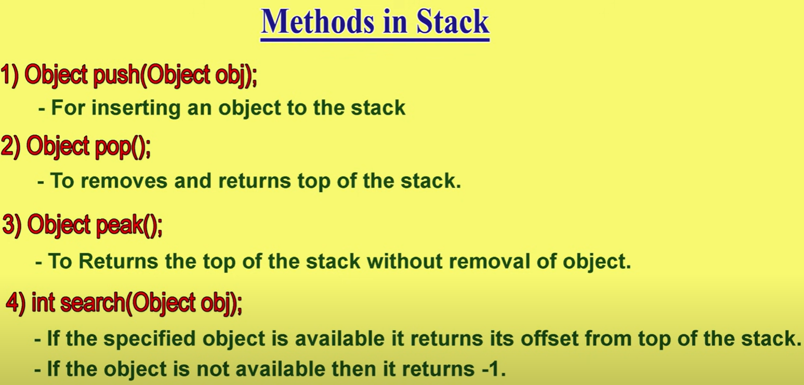

## Collection Framework

### Collection


### Collection Framework


### Collection vs Collections


### Collection in Java vs Cplusplus


### list


### list tree


### set


### list and set differences


### set tree


### sorted set


### navigable set


### navigable set tree


### nine key interfaces of collection framework


## nine key interfaces of Collection framework vi Queue


## Map

`Map` is not the child interface of `Collection`. `Map` is separate than `Collection`. in `Map` we have `key` and `value`. both the `key` and `value` are objects.


## nine key interfaces of Collection framework viii SortedMap ix NavigableMap


## Collection Framework Overview

### Collection Interface


### Map Interface


## Collection Interface Details


### methods in Collection Interface


## List Interface details


## ArrayList details (Collection Framework)

ArrayList is the first implementation class of `list interface`.

- underline data structure for ArrayList is `Resizable Array or Growable Array`


### ArrayList Constructors


two more constructor we have. in first we provide initial capacity can be 1000 or more. so everytime garbage collection problem will be solved.
in the second constructor we can provide any other collection like `linklist` or `treeset`.


here below is a simple program. here if you observe the output is inside square brackets this is because of the `toString` method is called internally while we
do `System.out.println`

```
import java.util.*;
class ArrayListDemo
{
  public static void main(String[] args){
    ArrayList I = new ArrayList();
    I.add("A");
    I.add("10");
    I.add("A");
    I.add(null);
    System.out.println(I); // [A, 10, A, null]
    I.remove(2);
    System.out.println(I); // [A, 10, null]
    I.add(2,"M");
    I.add("N");
    System.out.println(I); // [A, 10, M, null, N]
  }
}
```

### Important points

1. so ArrayList implements `Serializable and cloneable interfaces`. This is true for all the Collection implementation classes.
   

2. `ArrayList` and `Vector` implements `RandomAccess` interface. which means we can access any element with same speed say 1 sec for example. `Random Access interface` present in `java.util` package. it doesn't contain any method it is a `marker interface`.


## Difference between ArrayList and Vector


## How to get Synchronized ArrayList Object

By default ArrayList is non-synchronized but we can get synchronized version of ArrayList by using `Collections` class `synchronizedList()` method.

```
    ArrayList l1 = new ArrayList();
    List l = Collections.synchronizedList(l1);
```


## LinkedList details


## LinkedList methods


## LinkedList Constructors


one small program

```
import java.util.*;
public class LinkedListDemo{
  public static void main(String[] args){
    LinkedList l1 = new LinkedList();
    l1.add("durga"); // [durga]
    l1.add(30); // [durga,30]
    l1.add(null); // [durga, 30, null]
    l1.set(0,"software"); // [software,30,null]
    l1.add(0,"venkey"); // [venkey, software,30,null]
    l1.addFirst("ccc"); // [ccc, venkey, software, 30, null]
    l1.removeLast(); // [ccc, venkey, software, 30 ]
    System.out.println(l1); // [ccc, venkey, software, 30]
  }
}
```

## Difference between ArrayList and LinkedList


## Vector class details


## Vector specific methods

in ArrayList very short names for methods. in vector very long name for methods because vector came in 1.0 version and ArrayList in 1.2V


enumeration method means if we want to get the objects one by one one by one.

## vector class constructors


a small program for vectors

```
import java.util.*;
class VectorDemo1{
  public static void main(String [] args){
    Vector v = new Vector();
    for (int i =1; i<=10; i++){
      v.addElement(i);
    }
    System.out.println(v.capacity()); // 10
    v.addElement("A");
    System.out.println(v.capacity()); //20
    System.out.println(v); // [1, 2, 3, 4, 5, 6, 7, 8, 9, 10, A]

  }
}
```

```
    // default initial capacity
    Vector v = new Vector(25);
    for (int i =1; i<=10; i++){
      v.addElement(i);
    }
    System.out.println(v.capacity()); // 15
    v.addElement("A");
    System.out.println(v.capacity()); //25
    System.out.println(v); // [1, 2, 3, 4, 5, 6, 7, 8, 9, 10, A]

```

```
    // incremental default initial capacity
    Vector v = new Vector(10,5);
    for (int i =1; i<=10; i++){
      v.addElement(i);
    }
    System.out.println(v.capacity()); // 10
    v.addElement("A");
    System.out.println(v.capacity()); //15
    System.out.println(v); // [1, 2, 3, 4, 5, 6, 7, 8, 9, 10, A]
```

## Stack

- it is a child class of vector
- it is specially designed class for LIFO

### Stack constructor

`Stack s = new Stack();`

### Stack methods

1. push(Object o)
2. pop() --- remove and return top of stack
3. peek() --- only return top of stack not remove
4. empty() --- to check if stack is empty
5. search("A") --- return offset from top of the stack i.e 3 or 4 etc, if not available return -1



```
import java.util.*;
class StackDemo{
  public static void main(String [] args){
    Stack s = new Stack();
    s.push("A");
    s.push("B");
    s.push("C");
    System.out.println(s); // [A, B, C] insertion order is preserved
    System.out.println(s.search("A")); // 3
    System.out.println(s.search("Z")); // -1

  }
}
```

## Three Cursors of Java


### 1. Enumeration


### methods of Enumeration


here is a simple program

```
import java.util.*;
class EnumerationDemo{
  public static void main(String [] args){
    Vector v = new Vector();
    for (int i=0; i<=10; i++){
      v.addElement(i);
    }
    System.out.println(v); // [0, 1, 2, 3, 4, 5, 6, 7, 8, 9, 10]
    Enumeration e = v.elements();
    while(e.hasMoreElements()){
      Integer I = (Integer)e.nextElement();
      if (I % 2 == 0){
        System.out.println(I); // output one be one even numbers

      }
    }
    System.out.println(v); // [0, 1, 2, 3, 4, 5, 6, 7, 8, 9, 10]
  }
}
```

enumeration has some limitations so we use `Iterators`.

- Enumeration is only applicable to legacy classes.
- Enumeration can perform only read operation not the remove operation.

### 2. Iterator


`Iterator itr = c.Iterator();` where is the object of any collection.

### Iterator Object


here we have a simple program

```
import java.util.*;
class IteratorDemo{
  public static void main(String [] args){
    ArrayList I = new ArrayList();
    for (int i=0; i<=10; i++){
      I.add(i);
    }
    System.out.println(I); // [0, 1, 2, 3, 4, 5, 6, 7, 8, 9, 10]
    Iterator itr = I.iterator();
    while(itr.hasNext()){
      Integer L = (Integer)itr.next();
      if (L % 2 == 0){
        System.out.println(L);
      }
      else {
        itr.remove();
      }
    }
    System.out.println(I); // [0, 2, 4, 6, 8, 10]
  }
}
```

### limitations of Iterator

1. always move in forward direction. so moving single direction only. sometime we need bidirectional cursors.
2. addition of new objects not possible
3. replacement of objects not possible


### 3. ListIterators


